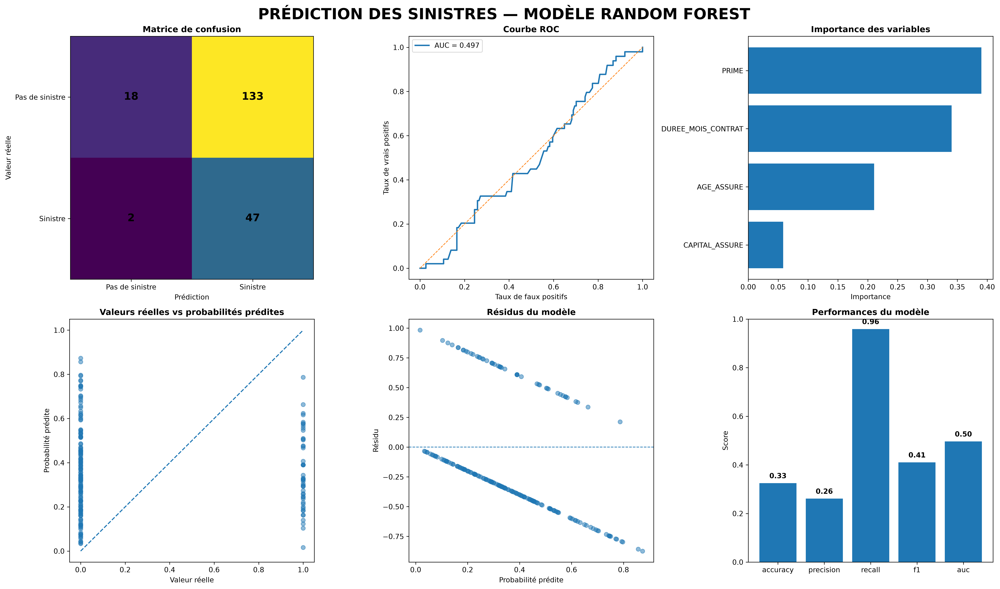

# Prédiction des sinistres — Random Forest

Pipeline de machine learning pour prédire la survenance d'un sinistre à partir
de données d'assurance (âge de l'assuré, capital assuré, prime, durée du contrat).



## Contexte

Le modèle traite un problème de classification binaire déséquilibré. Le
pipeline compare un modèle de référence (régression logistique) à une forêt
aléatoire optimisée par recherche d'hyperparamètres, et détermine un seuil de
décision adapté au déséquilibre des classes plutôt que le seuil par défaut
de 0.5.

## Jeu de données

Le projet est livré avec le dataset **`insurance_claims`** (Derrick Mwiti,
[GitHub](https://github.com/mwitiderrick/insurancedata)) : 1000 sinistres
auto réels, cible = fraude déclarée (`fraud_reported`, ~25% de fraudes).

Comme ce dataset ne contient que des sinistres déjà survenus (pas de contrats
sans sinistre), la cible binaire n'est pas "y a-t-il eu un sinistre ?" mais
"le sinistre est-il frauduleux ?" — c'est l'adaptation la plus fidèle possible
à la structure de classification déséquilibrée du projet d'origine avec un
jeu de données réel et librement accessible.

**Mapping des colonnes** (défini dans `src/config.py`, `RENAME_MAP`) :

| Colonne source            | Colonne interne      |
|----------------------------|-----------------------|
| `age`                      | `AGE_ASSURE`          |
| `months_as_customer`       | `DUREE_MOIS_CONTRAT`  |
| `policy_annual_premium`    | `PRIME`               |
| `umbrella_limit`           | `CAPITAL_ASSURE`      |
| `total_claim_amount`       | `SINISTRE_REGLE` (informatif) |
| `fraud_reported` (Y/N)     | cible (`TARGET_MODE = "label"`) |

Pour rebrancher un autre dataset (y compris ton fichier `donnees_sinistres.csv`
d'origine avec `DATE_NAISSANCE_CLIENT`/`DATE_EFFET`/`SINISTRE_REGLE`), il
suffit de modifier `RENAME_MAP` et `TARGET_MODE` dans `config.py` — le reste
du pipeline n'a pas besoin d'être touché. Avec `TARGET_MODE = "amount_threshold"`,
le pipeline retrouve le comportement d'origine (cible = 1 si montant réglé > 0).

**Limite connue** : avec seulement 4 variables numériques (âge, capital,
prime, durée), l'AUC obtenue sur ce dataset est proche de 0.50 — ces
variables ne suffisent pas à prédire la fraude, qui dépend surtout du
contexte de l'incident (type de collision, gravité, témoins, déclarations).
C'est attendu : ce dataset sert ici de test de compatibilité pour le pipeline,
pas de démonstration de performance. Pour un vrai cas d'usage fraude, ajoute
`incident_severity`, `witnesses`, `police_report_available`, etc. à
`CANDIDATE_FEATURES` (après encodage des variables catégorielles).

## Structure du projet

```
prediction-sinistres-machine-learning/
│
├── data/
│   └── donnees_sinistres.csv       # Données brutes (non versionné si sensible)
│
├── src/
│   ├── config.py                   # Toute la configuration du pipeline
│   ├── data_loading.py             # Chargement et validation du CSV
│   ├── preprocessing.py            # Nettoyage, feature engineering
│   ├── model.py                    # Entraînement, recherche d'hyperparamètres, CV
│   ├── evaluation.py               # Métriques, seuil optimal, importance
│   ├── visualization.py            # Génération du dashboard graphique
│   └── main.py                     # Point d'entrée (orchestration)
│
├── results/
│   ├── random_forest_sinistres.png
│   ├── predictions_random_forest.csv
│   ├── importance_variables.csv
│   └── random_forest_model.joblib  # Modèle entraîné, réutilisable
│
├── notebooks/
│   └── analyse_sinistres.ipynb     # Exploration libre, hors pipeline de prod
│
├── requirements.txt
├── .gitignore
└── README.md
```

## Installation

```bash
git clone <url-du-repo>
cd prediction-sinistres-machine-learning
python3 -m venv venv
source venv/bin/activate      # Windows : venv\Scripts\activate
pip install -r requirements.txt
```

## Utilisation

Placer `donnees_sinistres.csv` dans `data/`, puis :

```bash
# Pipeline complet avec recherche d'hyperparamètres (plus lent, plus précis)
python -m src.main

# Version rapide sans recherche d'hyperparamètres
python -m src.main --skip-search

# Chemin de données personnalisé
python -m src.main --data data/mon_fichier.csv
```

## Méthodologie

1. **Nettoyage** : normalisation des noms de colonnes, parsing des dates,
   calcul de l'âge de l'assuré avec détection des valeurs aberrantes.
2. **Variable cible** : `SINISTRE_CIBLE` = 1 si `SINISTRE_REGLE` > 0.
3. **Modèle de référence** : régression logistique (`class_weight="balanced"`)
   pour évaluer l'apport réel du Random Forest.
4. **Random Forest** : recherche d'hyperparamètres par `RandomizedSearchCV`
   (30 itérations, validation croisée à 5 plis, optimisée sur le F1-score).
5. **Validation croisée** : accuracy, precision, recall, F1, AUC-ROC calculés
   sur 5 plis stratifiés pour une estimation robuste (pas un simple split).
6. **Seuil de décision** : recherche du seuil qui maximise le F1-score via la
   courbe précision-rappel, plutôt que d'utiliser 0.5 par défaut — pertinent
   ici car les classes sont déséquilibrées.
7. **Sauvegarde** : modèle (`joblib`), prédictions, importance des variables
   et dashboard graphique (matrice de confusion, ROC, importance, résidus,
   performances).

## Limites connues et pistes d'amélioration

- Seulement 4 variables explicatives disponibles actuellement ; l'ajout de
  variables (type de contrat, zone géographique, historique de sinistres)
  améliorerait probablement la performance.
- L'imputation des valeurs manquantes se fait par la médiane globale ; une
  imputation par sous-groupe (ex. par tranche d'âge) pourrait être plus fine.
- Le modèle n'est pas encore exposé via une API ; une prochaine étape possible
  est un service FastAPI chargeant `random_forest_model.joblib`.

## Auteur

Fleury — Master en Statistique Appliquée et Informatique Décisionnelle
